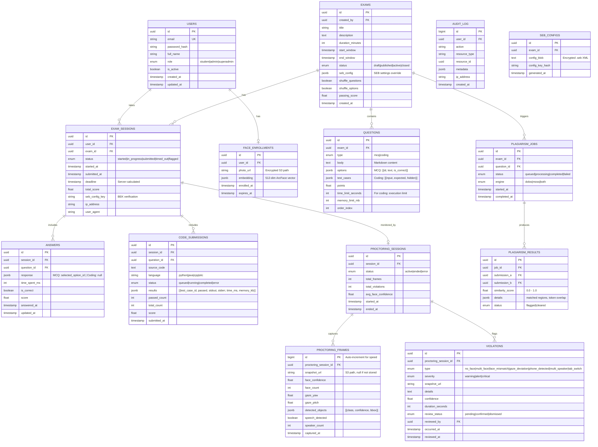
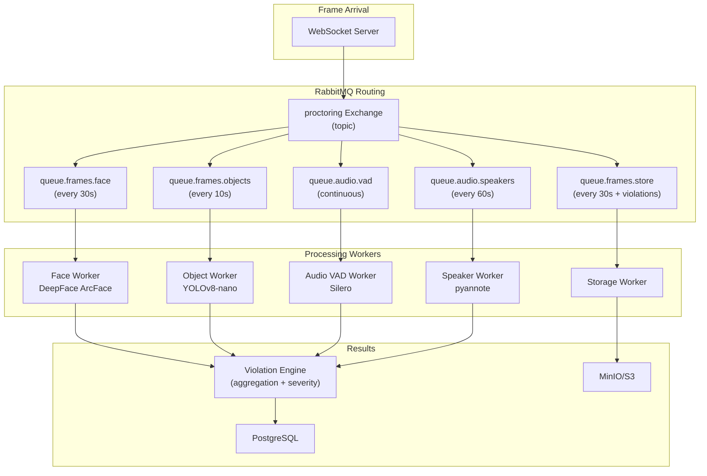
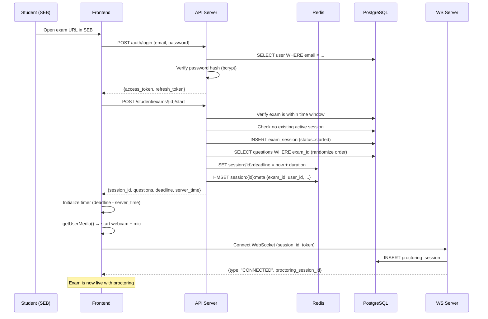
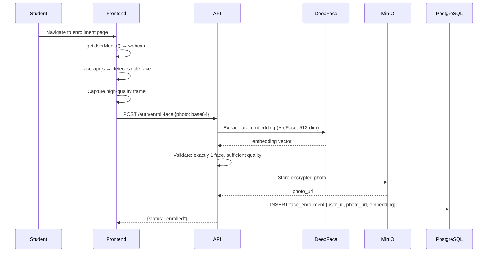
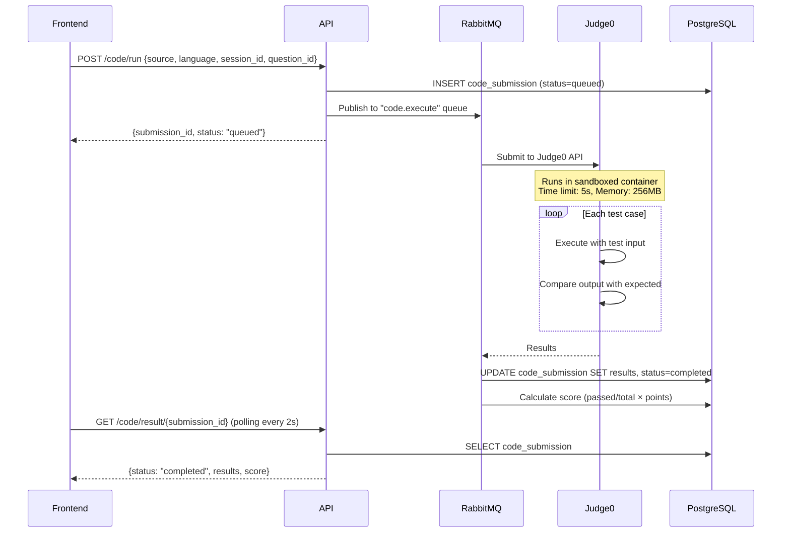

# SecureExam Platform — Low-Level System Design (LLD)

## 1. Database Schema

### Entity-Relationship Diagram



### Key Indexes

```sql
-- Performance-critical queries
CREATE INDEX idx_exam_sessions_user     ON exam_sessions(user_id, exam_id);
CREATE INDEX idx_exam_sessions_status   ON exam_sessions(status) WHERE status = 'started';
CREATE INDEX idx_answers_session        ON answers(session_id);
CREATE INDEX idx_code_subs_session      ON code_submissions(session_id, question_id);
CREATE INDEX idx_proctor_frames_session ON proctoring_frames(proctoring_session_id, captured_at);
CREATE INDEX idx_violations_session     ON violations(proctoring_session_id, severity);
CREATE INDEX idx_violations_pending     ON violations(review_status) WHERE review_status = 'pending';
CREATE INDEX idx_plagiarism_score       ON plagiarism_results(similarity_score DESC);
CREATE INDEX idx_audit_user_time        ON audit_log(user_id, created_at DESC);
```

---

## 2. API Specification

### 2.1 Authentication

```
POST /api/v1/auth/register
  Body: { email, password, full_name }
  Response: { user_id, message }

POST /api/v1/auth/login
  Body: { email, password }
  Response: { access_token, refresh_token, expires_in }

POST /api/v1/auth/refresh
  Body: { refresh_token }
  Response: { access_token, expires_in }

POST /api/v1/auth/enroll-face
  Body: multipart/form-data { photo: File }
  Headers: Authorization: Bearer <token>
  Response: { enrollment_id, status: "enrolled" }
```

### 2.2 Exam Management (Admin)

```
POST /api/v1/exams
  Body: { title, description, duration_minutes, start_window, end_window,
          shuffle_questions, shuffle_options, passing_score }
  Response: { exam_id }

POST /api/v1/exams/{exam_id}/questions
  Body: { type: "mcq"|"coding", body, options?, test_cases?, points, 
          time_limit_seconds?, memory_limit_mb? }
  Response: { question_id }

POST /api/v1/exams/{exam_id}/publish
  Response: { status: "published", seb_config_download_url }

GET  /api/v1/exams/{exam_id}/sessions
  Query: ?status=submitted&page=1&limit=20
  Response: { sessions: [...], total, page }

GET  /api/v1/exams/{exam_id}/results
  Response: { results: [{ user, score, violations_count, plagiarism_flags }] }
```

### 2.3 Exam Taking (Student)

```
GET  /api/v1/student/exams
  Response: { exams: [{ id, title, start_window, end_window, duration }] }

POST /api/v1/student/exams/{exam_id}/start
  Response: { session_id, questions: [...], deadline, server_time }

POST /api/v1/student/sessions/{session_id}/answer
  Body: { question_id, response: "option_id" | null }
  Response: { saved: true }

POST /api/v1/student/sessions/{session_id}/submit
  Response: { status: "submitted", score? }
```

### 2.4 Code Execution

```
POST /api/v1/code/run
  Body: { source_code, language, stdin?, session_id, question_id }
  Response: { submission_id, status: "queued" }

GET  /api/v1/code/result/{submission_id}
  Response: { status, results: [{ test_case, passed, stdout, stderr, 
              time_ms, memory_kb }], score }

POST /api/v1/code/submit  (final submission)
  Body: { source_code, language, session_id, question_id }
  Response: { submission_id, status: "queued", is_final: true }
```

### 2.5 Proctoring

```
WebSocket: wss://api.your-platform.com/api/v1/proctoring/stream
  Auth: ?token=<jwt>
  → See Section 3 for WebSocket protocol

GET  /api/v1/admin/proctoring/live
  Response: { active_sessions: [{ user, violation_count, last_frame_url }] }

GET  /api/v1/admin/violations
  Query: ?severity=critical&status=pending&exam_id=...
  Response: { violations: [...], total }

PATCH /api/v1/admin/violations/{id}
  Body: { review_status: "confirmed"|"dismissed" }
  Response: { updated: true }
```

### 2.6 Plagiarism

```
POST /api/v1/admin/plagiarism/check
  Body: { exam_id, question_id?, engine: "dolos"|"moss"|"both" }
  Response: { job_id, status: "queued" }

GET  /api/v1/admin/plagiarism/jobs/{job_id}
  Response: { status, results_count, flagged_count }

GET  /api/v1/admin/plagiarism/results
  Query: ?job_id=...&min_score=0.7
  Response: { pairs: [{ student_a, student_b, similarity, details }] }
```

---

## 3. WebSocket Proctoring Protocol

### Connection Handshake

```
Client → Server: wss://api/v1/proctoring/stream?token=<jwt>&session_id=<uuid>
Server → Client: { type: "CONNECTED", proctoring_session_id: "<uuid>" }
```

### Message Types

```typescript
// Client → Server Messages
type ClientMessage =
  | { type: "FRAME",   data: string,  ts: number }  // base64 JPEG (320×240)
  | { type: "AUDIO",   data: string,  ts: number }  // base64 Opus chunk (5s)
  | { type: "EVENT",   event: BrowserEvent }
  | { type: "HEARTBEAT" }

type BrowserEvent = 
  | { name: "focus_lost",   ts: number }
  | { name: "focus_gained", ts: number }
  | { name: "resize",       width: number, height: number }
  | { name: "paste_attempt", ts: number }

// Server → Client Messages  
type ServerMessage =
  | { type: "WARNING",    message: string, violation_type: string }
  | { type: "ALERT",      message: string, violation_type: string }
  | { type: "CRITICAL",   message: string, action: "pause"|"terminate" }
  | { type: "ACK",        frame_id: number }
  | { type: "TIME_SYNC",  server_time: number }
  | { type: "HEARTBEAT_ACK" }
```

### Frame Processing Rate

| Check | Frequency | Server Load |
|-------|:---------:|-------------|
| Client-side face count | Every frame (3s) | None (runs in browser) |
| Server face verification | Every 30s | 1 inference per 30s per user |
| Object detection (YOLOv8) | Every 10s | 1 inference per 10s per user |
| Audio VAD | Continuous (5s chunks) | Lightweight, CPU only |
| Speaker diarization | Every 60s | 1 inference per 60s per user |

**At 500 users:**
- Face verification: ~17 inferences/sec → 1 GPU handles this easily
- Object detection: ~50 inferences/sec → YOLOv8-nano at ~100 FPS on T4, 1 GPU sufficient
- Audio: ~100 chunks/sec → CPU-only (Silero VAD is very lightweight)

---

## 4. AI Proctoring Pipeline — Detailed Processing



### Violation Engine Logic (Pseudocode)

```python
class ViolationEngine:
    # Thresholds
    FACE_MATCH_THRESHOLD = 0.6          # DeepFace similarity
    GAZE_DEVIATION_THRESHOLD = 30       # degrees from center
    GAZE_SUSTAINED_SECONDS = 15         # how long before flagging
    PHONE_CONFIDENCE_THRESHOLD = 0.7    # YOLOv8 confidence
    MULTI_SPEAKER_THRESHOLD = 2         # speaker count

    def process_face_result(self, session_id, similarity, face_count):
        if face_count == 0:
            if self.duration_no_face(session_id) > 5:
                self.flag(session_id, "no_face", "warning")
            if self.duration_no_face(session_id) > 15:
                self.flag(session_id, "no_face", "alert")
        
        elif face_count > 1:
            self.flag(session_id, "multi_face", "alert")
        
        elif similarity < FACE_MATCH_THRESHOLD:
            self.flag(session_id, "face_mismatch", "critical")

    def process_object_result(self, session_id, detections):
        for obj in detections:
            if obj.class_name == "cell phone" and obj.confidence > 0.7:
                self.flag(session_id, "phone_detected", "critical")
            elif obj.class_name == "book" and obj.confidence > 0.7:
                self.flag(session_id, "book_detected", "alert")

    def process_audio_result(self, session_id, speech, speaker_count):
        if speaker_count >= 2:
            self.flag(session_id, "multi_speaker", "critical")

    def flag(self, session_id, type, severity):
        # Deduplication: don't flag same type within 30s window
        if self.recent_violation(session_id, type, window=30):
            return
        
        violation = Violation(session_id, type, severity, snapshot_url, timestamp)
        db.insert(violation)
        notify_admin(violation)  # Push via WebSocket to admin dashboard
        
        if severity == "critical":
            notify_student(session_id, "warning_displayed")
```

---

## 5. Key Sequence Diagrams

### 5.1 Exam Start (Full Flow)



### 5.2 Face Enrollment



### 5.3 Code Submission Flow



---

## 6. Caching Strategy (Redis)

| Key Pattern | TTL | Purpose |
|---|---|---|
| `session:{id}:deadline` | exam duration | Server-side timer (source of truth) |
| `session:{id}:meta` | exam duration + 1hr | Session metadata cache |
| `session:{id}:answers` | exam duration | Write-behind buffer for answers |
| `user:{id}:token` | 15min | JWT validation cache |
| `exam:{id}:questions` | until exam closes | Question cache (avoid DB reads) |
| `proctor:{session_id}:state` | exam duration | Face state (last seen, no-face duration) |
| `proctor:{session_id}:violations:recent` | 30s (sliding) | Deduplication window |
| `ratelimit:{user_id}:{endpoint}` | 1min | Rate limiting counters |
| `ws:connections` | – (SET) | Track active WebSocket connections per server |

### Write-Behind Pattern for Answers
```
Student answers → Redis HSET session:{id}:answers → 
  Flush to PostgreSQL every 10s OR on exam submit (whichever first)
```

---

## 7. Queue Topology (RabbitMQ)

```
Exchange: proctoring (topic)
├── Routing: frame.face      → queue.frames.face     (3 consumers)
├── Routing: frame.objects    → queue.frames.objects   (2 consumers)
├── Routing: audio.vad        → queue.audio.vad        (2 consumers)
├── Routing: audio.speakers   → queue.audio.speakers   (1 consumer)
└── Routing: frame.store      → queue.frames.store     (2 consumers)

Exchange: code (direct)
└── Routing: execute          → queue.code.execute     (4 consumers)

Exchange: plagiarism (direct)
└── Routing: check            → queue.plagiarism.check (1 consumer)

Exchange: notifications (fanout)
├── → queue.notifications.email
└── → queue.notifications.websocket
```

---

## 8. SEB Configuration Spec

Generated per exam as a `.seb` file:

```xml
<?xml version="1.0" encoding="utf-8"?>
<!DOCTYPE plist PUBLIC "-//Apple//DTD PLIST 1.0//EN">
<plist version="1.0">
<dict>
    <!-- Exam URL -->
    <key>startURL</key>
    <string>https://exam.your-platform.com/session/{exam_id}</string>

    <!-- Security -->
    <key>allowQuit</key>        <false/>
    <key>allowSpellCheck</key>  <false/>
    <key>enableClipboard</key>  <false/>
    
    <!-- Browser -->    
    <key>enableJavaScript</key>       <true/>
    <key>allowMediaAutoCapture</key>  <true/>
    <key>mediaAutoCaptureMicrophone</key> <true/>
    <key>mediaAutoCaptureCamera</key> <true/>
    
    <!-- URL Filter -->
    <key>URLFilterEnable</key>  <true/>
    <key>URLFilterRules</key>
    <array>
        <dict>
            <key>action</key>   <integer>1</integer>  <!-- allow -->
            <key>expression</key>
            <string>exam.your-platform.com/*</string>
        </dict>
    </array>
    
    <!-- Quit -->
    <key>quitURL</key>
    <string>https://exam.your-platform.com/submitted</string>
</dict>
</plist>
```

---

## 9. Error Handling Matrix

| Error Code | HTTP Status | Scenario | Client Action |
|:----------:|:----------:|----------|---------------|
| `AUTH_001` | 401 | Invalid credentials | Show error, retry |
| `AUTH_002` | 403 | Account disabled | Contact admin |
| `EXAM_001` | 409 | Session already exists | Resume existing session |
| `EXAM_002` | 403 | Exam not in time window | Show "exam not available" |
| `EXAM_003` | 410 | Deadline passed | Auto-submit, show results |
| `CODE_001` | 408 | Execution timeout | Show TLE message |
| `CODE_002` | 500 | Judge0 unavailable | Retry queue, show "processing" |
| `PROC_001` | – | WebSocket disconnect | Auto-reconnect (exp. backoff, max 5) |
| `PROC_002` | – | Camera permission denied | Block exam start, show instructions |
| `PLAG_001` | 503 | MOSS/Dolos unavailable | Retry later, notify admin |
