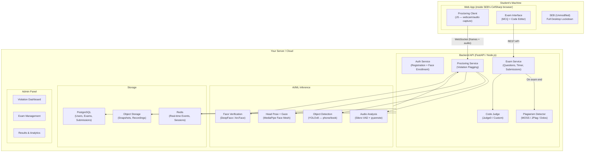

# SecureExam Platform — Architecture & Implementation Plan

## Goal

Build a **comprehensive, all-in-one secure examination platform** that combines:
1. **SEB (Safe Exam Browser)** for full desktop lockdown
2. **AI-powered proctoring** (face verification, gaze tracking, multi-person detection, phone detection, audio monitoring)
3. **Exam delivery** (MCQ + coding questions with live code execution)
4. **Code plagiarism detection** (automated similarity analysis across all submissions)

> [!IMPORTANT]
> **Core Architecture Decision**: Use SEB **as-is** for lockdown. Build everything else as a **web application** that runs inside SEB's CefSharp browser. This avoids modifying SEB's complex C# codebase while getting all the security benefits. The web app uses standard browser APIs (`getUserMedia`, `WebRTC`) for webcam/audio access.

---

## High-Level Architecture



---

## Component Breakdown

### Component 1: SEB Configuration (No Code Changes)

SEB is used as-is. We create a custom `.seb` configuration file:

| Setting | Value | Purpose |
|---------|-------|---------|
| `startURL` | `https://your-exam-platform.com` | Opens your exam web app |
| `allowURLFilter` | Whitelist your domain only | Blocks all other websites |
| `enableBrowserWindowToolbar` | `false` | Clean exam interface |
| `allowSpellCheck` | `false` | Prevents spell-check assistance |
| `enableJavaScript` | `true` | Required for proctoring JS |
| `allowMediaCapture` | `true` | **Critical**: allows webcam/mic access |
| `clipboardPolicy` | `isolated` | Blocks copy-paste from outside |
| `allowQuit` | `false` | Prevents quitting during exam |
| `quitURLConfirm` | `https://your-platform.com/submit` | Only exit after submission |

> [!NOTE]
> CefSharp (SEB's browser engine) supports the `getUserMedia` API for webcam and microphone access. The `.seb` config needs to grant media permissions.

---

### Component 2: Frontend — Exam Interface + Proctoring Client

**Tech Stack**: React/Next.js or Vanilla JS + Monaco Editor

#### 2a. Exam Interface
- **MCQ Module**: Render questions, track time per question, randomize order per student
- **Code Editor**: Monaco Editor (VS Code's editor) embedded in browser
- **Timer**: Server-synced countdown timer (prevents client-side manipulation)
- **Navigation**: Sidebar showing answered/flagged/unanswered questions

#### 2b. Proctoring Client (runs in browser)

```
┌─────────────────────────────────────────────┐
│  Browser-Side Proctoring (JavaScript)       │
│                                             │
│  ┌──────────┐  getUserMedia    ┌──────────┐ │
│  │  Webcam  │ ───────────────► │ Canvas   │ │
│  └──────────┘                  │ Capture  │ │
│                                └────┬─────┘ │
│  ┌──────────┐  getUserMedia    ┌────▼─────┐ │
│  │   Mic    │ ───────────────► │ Audio    │ │
│  └──────────┘                  │ Chunks   │ │
│                                └────┬─────┘ │
│                                     │       │
│              WebSocket              ▼       │
│         ┌─────────────────────────────┐     │
│         │  Send to Server every 3-5s  │     │
│         │  • Webcam frame (JPEG)      │     │
│         │  • Audio chunk              │     │
│         │  • Browser focus events     │     │
│         │  • Keystroke metadata       │     │
│         └─────────────────────────────┘     │
└─────────────────────────────────────────────┘
```

**What runs client-side (lightweight, in JS)**:
- `face-api.js` for real-time face count (alert immediately if 0 or >1 faces)
- Head pose estimation (MediaPipe Face Mesh via TensorFlow.js) for gaze deviation
- Periodic webcam snapshots sent to server for deeper analysis

**What runs server-side (heavier AI models)**:
- Face verification (match against enrolled photo)
- YOLOv8 object detection (phone, book, second screen)
- Audio analysis (multiple speakers, background voices)

---

### Component 3: Backend API

**Tech Stack**: Python (FastAPI) — best ecosystem for ML integration

| Endpoint Group | Key Endpoints | Purpose |
|---|---|---|
| `/auth` | `POST /register`, `POST /login`, `POST /enroll-face` | User registration + face photo enrollment |
| `/exams` | `GET /exams`, `POST /exams/{id}/start`, `POST /exams/{id}/submit` | Exam lifecycle |
| `/questions` | `GET /exams/{id}/questions`, `POST /questions/{id}/answer` | Question delivery + answer collection |
| `/code` | `POST /code/run`, `POST /code/submit` | Code execution via Judge0 |
| `/proctoring` | `WS /proctoring/stream` | WebSocket for real-time webcam/audio frames |
| `/violations` | `GET /violations`, `POST /violations/{id}/review` | Admin violation management |
| `/plagiarism` | `POST /plagiarism/check`, `GET /plagiarism/report` | Code similarity analysis |
| `/admin` | CRUD for exams, questions, users, results | Admin panel API |

---

### Component 4: AI Proctoring Engine

| Detection | Model/Tool | Input | Output | Runs Where |
|-----------|-----------|-------|--------|-----------|
| **Face present?** | `face-api.js` (SSD MobileNet) | Webcam frame | face count, bounding boxes | Browser (real-time) |
| **Is it the right person?** | DeepFace (ArcFace) | Webcam frame + enrolled photo | similarity score (0–1) | Server (every 30s) |
| **Looking at screen?** | MediaPipe Face Mesh | Webcam frame | head pose angles (yaw, pitch, roll) | Browser (real-time) |
| **Phone/book in view?** | YOLOv8-nano | Webcam frame | detected objects + confidence | Server (every 10s) |
| **Someone talking?** | Silero VAD | Audio chunk | speech probability | Server (continuous) |
| **Multiple speakers?** | pyannote-audio | Audio chunks | speaker count | Server (every 60s) |

#### Violation Severity Levels

| Level | Trigger | Action |
|-------|---------|--------|
| 🟡 **Warning** | Face not detected for >5s, minor gaze deviation | Show warning to student |
| 🟠 **Alert** | Multiple faces detected, sustained gaze away (>15s) | Alert + log + snapshot |
| 🔴 **Critical** | Face mismatch, phone detected, multiple speakers | Alert + flag for admin review + auto-pause exam option |

---

### Component 5: Code Execution Engine

Use **[Judge0](https://github.com/judge0/judge0)** (self-hosted, open-source):
- Supports 60+ languages
- Sandboxed execution (Docker/isolate)
- Time/memory limits per test case
- REST API for submission and result polling

---

### Component 6: Plagiarism Detection

Run **after exam ends** across all submissions:

| Tool | What It Detects | Language Support |
|------|----------------|-----------------|
| **[Dolos](https://dolos.ugent.be/)** | Code plagiarism (AST-based, very accurate) | Python, Java, JS, C/C++, etc. |
| **[MOSS](https://theory.stanford.edu/~aiken/moss/)** | Code similarity (Stanford, industry standard) | 25+ languages |
| **[JPlag](https://github.com/jplag/jplag)** | Token-based code similarity | Java, Python, C/C++, etc. |
| **Custom**: Levenshtein + AST diff | Direct copy detection | Any |

**Recommended**: Use **Dolos** (open-source, self-hostable, modern) as primary + **MOSS** as secondary.

---

### Component 7: Admin Dashboard

A web-based panel for exam organizers:

- **Exam Management**: Create exams, add MCQ/coding questions, set time limits
- **Live Monitoring**: Real-time view of all active exam sessions with violation counts
- **Violation Review**: See flagged clips/snapshots, confirm or dismiss violations
- **Plagiarism Reports**: Visual similarity heatmaps across submissions
- **Results Export**: CSV/PDF export of scores and violation reports

---

## Tech Stack Summary

| Layer | Technology | Why |
|-------|-----------|-----|
| **Lockdown Browser** | SEB (unmodified) | Proven, battle-tested, open-source |
| **Frontend** | Next.js + Monaco Editor + face-api.js + MediaPipe | Rich exam UI + client-side proctoring |
| **Backend API** | Python FastAPI | Best ML ecosystem, async WebSocket support |
| **Database** | PostgreSQL | Reliable, relational data |
| **Cache/Events** | Redis | Real-time violation events, session state |
| **Object Storage** | MinIO (self-hosted S3) | Webcam snapshots, recordings |
| **Code Execution** | Judge0 (Docker) | Sandboxed, multi-language |
| **Face Verification** | DeepFace (ArcFace backend) | State-of-the-art accuracy |
| **Object Detection** | YOLOv8-nano (Ultralytics) | Fast, accurate, lightweight |
| **Audio Analysis** | Silero VAD + pyannote-audio | Speech detection + speaker counting |
| **Plagiarism** | Dolos + MOSS | AST-based + token-based detection |
| **Deployment** | Docker Compose / Kubernetes | Reproducible, scalable |

---

## Project Structure (Proposed)

```
secure-exam-platform/
├── frontend/                    # Next.js exam web app
│   ├── components/
│   │   ├── ExamInterface/       # MCQ + Code editor
│   │   ├── Proctoring/          # Webcam/audio capture + client-side AI
│   │   └── Admin/               # Admin dashboard components
│   └── pages/
├── backend/                     # FastAPI backend
│   ├── api/
│   │   ├── auth.py
│   │   ├── exams.py
│   │   ├── proctoring.py
│   │   ├── code_judge.py
│   │   └── plagiarism.py
│   ├── ai/
│   │   ├── face_verification.py
│   │   ├── object_detection.py
│   │   ├── gaze_estimation.py
│   │   └── audio_analysis.py
│   ├── models/                  # SQLAlchemy DB models
│   └── core/                    # Config, security, utils
├── judge0/                      # Judge0 Docker config
├── seb-config/                  # .seb configuration files
├── docker-compose.yml           # Full stack deployment
└── docs/
```

---

## Development Phases & Timeline

| Phase | What | Duration | Milestone |
|:-----:|------|:--------:|-----------|
| **1** | Core exam platform (MCQ + code editor + Judge0 integration) | 3–4 weeks | Students can take exams with code execution |
| **2** | SEB integration + basic proctoring (face detection, gaze tracking in browser) | 2–3 weeks | Exams run inside SEB with webcam monitoring |
| **3** | Server-side AI (face verification, phone detection, audio analysis) | 3–4 weeks | Full AI proctoring with violation flagging |
| **4** | Plagiarism detection + admin dashboard | 2–3 weeks | Post-exam code similarity reports |
| **5** | Polish, testing, deployment | 2–3 weeks | Production-ready platform |
| **Total** | | **12–17 weeks** | |

---

## Verification Plan

Since this is a **new platform** (not modifying existing code), verification is about validating each component:

### Automated Tests
- **Backend API**: pytest with FastAPI TestClient — test all endpoints
- **Proctoring AI**: Unit tests with sample images/audio — verify detection accuracy
- **Code Judge**: Integration tests submitting known solutions and checking verdicts
- **Plagiarism**: Test with known-similar and known-different code pairs

### Manual / Browser Testing
- Run the full stack via `docker-compose up`
- Open the web app inside SEB — verify lockdown works
- Test webcam/audio capture in CefSharp
- Simulate violations (look away, show phone, bring another person) — verify detection
- Submit code and verify Judge0 execution + plagiarism detection

---

## User Review Required

> [!IMPORTANT]
> **Key decisions that need your input:**
> 1. **Target scale**: How many concurrent exam-takers? (50? 500? 5000?) — This affects the infrastructure architecture significantly
> 2. **Hosting**: Self-hosted (your own server) or cloud (AWS/GCP/Azure)?
> 3. **SEB requirement**: Should this be SEB-only (Windows participants must use SEB), or should it also work in a regular browser with reduced security?
> 4. **Languages for coding**: Which programming languages do you want to support for the coding questions?
> 5. **Budget for infrastructure**: Any GPU servers available for AI inference? (YOLOv8 and DeepFace benefit greatly from GPU)
