# SecureExam Platform — High-Level System Design (HLD)

## 1. System Context

```mermaid
graph TB
    subgraph Users
        Student["👨‍🎓 Student<br/>(SEB on Windows/Mac)"]
        Admin["👨‍💼 Admin/Organizer<br/>(Web Browser)"]
    end
    
    subgraph Platform["SecureExam Platform"]
        FE["Web Frontend"]
        BE["Backend Services"]
        AI["AI/ML Engine"]
        Judge["Code Execution"]
        Store["Data & Storage"]
    end
    
    subgraph External
        SEB["SEB (Lockdown Client)"]
        SMTP["Email Service"]
        OAuth["OAuth Provider<br/>(Google/GitHub)"]
    end
    
    Student -->|"Takes exam via"| SEB
    SEB -->|"Loads"| FE
    Admin -->|"Manages exams"| FE
    FE <-->|"API calls"| BE
    BE <--> AI & Judge & Store
    BE --> SMTP
    BE <--> OAuth
```

**Key Constraints Driving Design:**

| Constraint | Impact |
|---|---|
| 500+ concurrent users | Need horizontal scaling, connection pooling, async processing |
| Real-time proctoring | WebSocket connections, frame processing pipeline, GPU inference |
| SEB on Windows + Mac | Web app must work in CefSharp (Chromium) — standard web APIs only |
| Language-agnostic coding | Judge0 with Docker-based sandboxing for 60+ languages |
| GPU for AI | Dedicated GPU nodes for inference, separated from API servers |

---

## 2. Infrastructure Architecture

### Infrastructure Sizing (500 Concurrent Users)

| Resource | Spec | Count | Purpose |
|----------|------|:-----:|---------|
| **API Servers** | 4 vCPU, 8GB RAM | 3 | REST API handling |
| **WebSocket Servers** | 4 vCPU, 8GB RAM | 2 | 500 persistent WS connections |
| **GPU Nodes** | 4 vCPU, 16GB RAM, 1x T4/A10G | 2 | AI inference (YOLOv8, DeepFace) |
| **Proctoring Workers** | 4 vCPU, 8GB RAM | 3 | Frame processing pipeline |
| **PostgreSQL** | 4 vCPU, 16GB RAM, 100GB SSD | 1+1 replica | Primary database |
| **Redis** | 2 vCPU, 8GB RAM | 1 cluster | Sessions, pub/sub, caching |
| **MinIO/S3** | – | 1 bucket | Webcam snapshots, recordings |
| **RabbitMQ** | 2 vCPU, 4GB RAM | 1 | Task queue |
| **Judge0** | 4 vCPU, 8GB RAM | 2 | Code execution (Docker) |

---

## 3. Component Architecture

### Service Responsibilities

| Service | Responsibility | Communication |
|---------|---------------|---------------|
| **User Service** | Registration, login, face enrollment, profile management | REST |
| **Exam Service** | CRUD exams/questions, exam session lifecycle, timer sync, scoring | REST |
| **Proctoring Service** | WebSocket connection management, frame routing, violation aggregation | WebSocket + Queue |
| **Code Judge Service** | Submit code to Judge0, poll results, format output | REST (async via queue) |
| **Plagiarism Service** | Post-exam batch analysis of all submissions via Dolos/MOSS | Async (queue-triggered) |
| **Media Processor** | Receive frames/audio, resize, route to AI models, store snapshots | Queue consumer |
| **Notification Service** | Email notifications, real-time admin alerts | Queue consumer + WebSocket |

---

## 4. Data Flow Diagrams

### 4.1 Exam Lifecycle Flow

### 4.2 Real-Time Proctoring Pipeline

```mermaid
sequenceDiagram
    participant B as Browser (JS)
    participant WS as WebSocket Server
    participant Q as RabbitMQ
    participant MP as Media Processor
    participant GPU as GPU Node
    participant DB as PostgreSQL
    participant S3 as MinIO/S3
    participant A as Admin Dashboard
    
    Note over B: getUserMedia() → webcam + mic access
    
    B->>WS: Connect WebSocket (JWT auth)
    WS->>DB: Log connection start
    
    loop Every 3 seconds (webcam)
        B->>B: Capture frame from video stream
        B->>B: face-api.js → count faces, basic gaze
        
        alt Client-side violation detected
            B->>WS: ALERT {type: "no_face" | "multi_face", frame}
        else Normal
            B->>WS: FRAME {jpeg_base64, timestamp, client_gaze}
        end
        
        WS->>Q: Publish to "proctoring.frames" queue
    end
    
    loop Every 5 seconds (audio)
        B->>WS: AUDIO {opus_chunk, timestamp}
        WS->>Q: Publish to "proctoring.audio" queue
    end
    
    MP->>Q: Consume frames
    MP->>S3: Store snapshot (every 30s or on violation)
    MP->>GPU: Face verification (every 30s)
    GPU-->>MP: Similarity score
    MP->>GPU: YOLOv8 object detection (every 10s)
    GPU-->>MP: Detected objects
    
    MP->>Q: Consume audio
    MP->>GPU: Silero VAD + pyannote
    GPU-->>MP: Speech detected, speaker count
    
    alt Violation detected
        MP->>DB: INSERT violation (type, severity, snapshot_url, timestamp)
        MP->>WS: Push violation alert to admin
        WS->>A: Real-time violation notification
    end
```

### 4.3 Plagiarism Detection Flow

---

## 5. Scalability Design

| Challenge | Solution |
|-----------|----------|
| 500 WebSocket connections | Sticky sessions on ALB, Redis pub/sub for cross-server events |
| Burst of frames (500 users × 1 frame/3s = ~167 frames/s) | RabbitMQ queue absorbs bursts, workers process at GPU speed |
| GPU bottleneck | Batch inference (process 8-16 frames together), auto-scale GPU nodes |
| Database write storm (answers) | Write-behind caching in Redis → periodic batch flush to PostgreSQL |
| Static assets (JS, CSS, Monaco Editor) | Serve via CDN, cache aggressively |
| Code execution spikes | Judge0 queue with configurable concurrency limit |
| Plagiarism (post-exam, CPU-heavy) | Async worker, runs after exam ends, no time pressure |

### Scaling Thresholds

| Users | API Nodes | WS Nodes | GPU Nodes | Workers |
|:-----:|:---------:|:--------:|:---------:|:-------:|
| ≤100 | 1 | 1 | 1 | 1 |
| 100–500 | 2 | 1 | 1 | 2 |
| 500–1000 | 3 | 2 | 2 | 3 |
| 1000–5000 | 5+ | 3+ | 4+ | 5+ |

---

## 6. Security Architecture

| Security Layer | Measure | Details |
|---|---|---|
| **Transport** | TLS 1.3 everywhere | Client ↔ ALB, service ↔ service |
| **Auth** | JWT (access 15min + refresh 7d) | Stateless, RS256 signed |
| **SEB Validation** | Config Key + Browser Exam Key | Server verifies request comes from SEB |
| **API** | Rate limiting (100 req/min per user) | Prevent abuse/scraping of questions |
| **Code Execution** | Judge0 isolate (seccomp, cgroups) | Prevents malicious code from escaping |
| **Face Data** | AES-256 encrypted, auto-purge after 30 days | GDPR-friendly |
| **Exam Integrity** | Questions encrypted at rest, randomized delivery | Prevents pre-exam leaks |
| **Admin** | 2FA required, audit log on all actions | Accountability |

---

## 7. Reliability & Failover

| Failure | Mitigation |
|---------|-----------|
| API server crash | ALB routes to healthy nodes, auto-scaling replaces |
| WebSocket disconnect | Client auto-reconnects with exponential backoff, session state in Redis survives |
| GPU node failure | Queue holds frames, second GPU node picks up, graceful degradation (skip AI for a few seconds) |
| Database failure | Read replica promotes, automated backups allow point-in-time recovery |
| Redis failure | Exam timers have DB fallback, sessions can be reconstructed |
| Judge0 timeout | Configurable timeout per submission, retry once, then report error |
| Network partition | Health checks detect, ALB stops routing to unhealthy nodes |

---

## 8. Monitoring & Observability

| What | Tool | Metrics |
|------|------|---------|
| **Infrastructure** | Prometheus + Grafana | CPU, memory, disk, network per node |
| **Application** | Structured logging (JSON) → ELK/Loki | Request latency, error rates, status codes |
| **WebSocket** | Custom metrics | Connection count, frame/s, queue depth |
| **AI Pipeline** | Custom metrics | Inference latency, queue backlog, GPU utilization |
| **Business** | Custom dashboard | Active exams, violations/min, submissions/min |
| **Alerting** | Grafana alerts → Slack/email | Error rate spike, queue backlog > threshold, GPU OOM |
